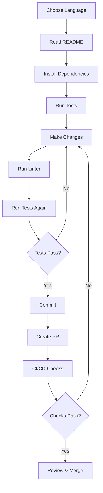

# Architecture Overview

This document provides a high-level overview of the repository's architecture and organization.

## Repository Structure

```
Reflekt/
├── Smart Contract Languages (On-Chain)
│   ├── solidity/       # Ethereum EVM
│   ├── vyper/          # Ethereum EVM (alternative syntax)
│   ├── move/           # Aptos/Sui
│   ├── rust/           # Solana (Anchor)
│   └── haskell/        # Cardano (Plutus)
│
├── Systems Programming (Performance-Critical)
│   ├── go/             # Backend services, signature verification
│   ├── cpp/            # Cryptographic primitives
│   └── zig/            # WebAssembly, low-level crypto
│
├── Web & Mobile (Client-Side)
│   ├── typescript/     # DApp frontends, Ethers.js, Viem
│   ├── java/           # Android/Enterprise (Web3j)
│   ├── swift/          # iOS/macOS wallet SDKs
│   └── html-css/       # Landing pages
│
├── Scripting & Automation (DevOps)
│   ├── python/         # CLI tools, automation
│   ├── ruby/           # Data indexing
│   └── bash/           # Deployment scripts
│
└── Infrastructure
    ├── .github/        # CI/CD, templates
    ├── contracts/      # Original Reputation NFT
    ├── src/            # Original Python backend
    └── frontend/       # Original Streamlit UI
```

## Language Selection Guide

### For Smart Contracts

| Platform | Language | When to Use |
|----------|----------|-------------|
| Ethereum | Solidity | Most mature ecosystem, widest support |
| Ethereum | Vyper | Security-critical contracts, simpler audits |
| Solana | Rust | High performance, low fees |
| Aptos/Sui | Move | Resource safety, formal verification |
| Cardano | Haskell | Academic rigor, provable correctness |

### For Backend Services

| Language | When to Use |
|----------|-------------|
| Go | High-performance APIs, signature verification |
| Python | Rapid prototyping, data analysis |
| Java | Enterprise systems, Android apps |
| C++ | Cryptographic operations, maximum performance |

### For Frontend

| Stack | When to Use |
|-------|-------------|
| TypeScript + React | Modern Web3 DApps |
| Swift | iOS native wallets |
| Java/Kotlin | Android native apps |
| HTML/CSS | Landing pages, documentation |

## Common Patterns

### 1. Wallet Management
- **Key Generation**: Go, Swift, Java
- **Signature Verification**: Go, C++, Rust
- **Transaction Signing**: All languages with Web3 support

### 2. Smart Contract Interaction
- **Deployment**: TypeScript (Hardhat), Python (Brownie), Rust (Anchor)
- **Reading State**: Any language with RPC client
- **Writing State**: Requires transaction signing

### 3. Data Indexing
- **Real-time**: Python, Ruby, Go
- **Batch Processing**: Python, Ruby
- **Analytics**: Python (Pandas), Ruby

## Security Architecture

### Defense in Depth

```
┌─────────────────────────────────────┐
│  1. Code Review & Audits            │
├─────────────────────────────────────┤
│  2. Automated Testing               │
│     - Unit tests                    │
│     - Integration tests             │
│     - Fuzzing                       │
├─────────────────────────────────────┤
│  3. Static Analysis                 │
│     - Linters                       │
│     - Type checkers                 │
│     - Security scanners             │
├─────────────────────────────────────┤
│  4. CI/CD Pipeline                  │
│     - Automated checks              │
│     - Dependency scanning           │
├─────────────────────────────────────┤
│  5. Secure Key Management           │
│     - Hardware wallets              │
│     - Environment variables         │
│     - Secrets management            │
└─────────────────────────────────────┘
```

### Key Security Principles

1. **Never commit secrets**: Use `.env` files and `.gitignore`
2. **Validate inputs**: All user inputs must be validated
3. **Audit dependencies**: Regular `npm audit`, `pip audit`, etc.
4. **Test on testnets first**: Never deploy directly to mainnet
5. **Follow language best practices**: Each language has specific security considerations

## Development Workflow



## CI/CD Pipeline

Our GitHub Actions workflow:

1. **Python Tests**: pytest, flake8, coverage
2. **TypeScript Lint**: ESLint, TypeScript compiler
3. **Solidity Compile**: Hardhat compilation
4. **Go Build**: go build and test
5. **Rust Build**: cargo build and test
6. **C++ Build**: g++ compilation
7. **Markdown Lint**: Documentation quality

## Integration Points

### Blockchain RPCs
- Ethereum: Alchemy, Infura, QuickNode
- Solana: Mainnet Beta, Devnet
- Aptos: Mainnet, Testnet

### Storage
- IPFS: Pinata, NFT.Storage
- Arweave: Permanent storage

### APIs
- TheGraph: Blockchain indexing
- Etherscan: Contract verification
- CoinGecko: Price feeds

## Performance Considerations

### Gas Optimization (EVM)
- Use `calldata` instead of `memory` for external functions
- Pack structs efficiently
- Use events instead of storage where possible
- Batch operations

### Solana Optimization
- Minimize account size
- Use PDAs efficiently
- Batch instructions
- Close accounts when done

## Future Architecture

Planned additions:
- [ ] Multi-chain bridge examples
- [ ] zkSync/StarkNet examples
- [ ] DAO governance contracts
- [ ] NFT marketplace contracts
- [ ] DeFi protocol examples
